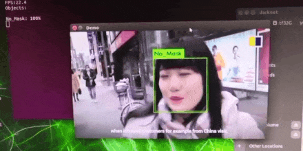

# maskOD_nano
Use 600 pcs of Masked and No_Masked people, trained and inferenced on Jetson Nano with Yolov3-Tiny

Click the GIF below can watch full demo 

Tasks prepared:
1. Install Darknet
2. Download darknet53.conv.74 && Yolov3-tiny.cfg
Steps
1. git clone this <repo> into your Jetson device, can be inside or outside <darknet>
2. Uncompress dataset.zip to <dataset> folder, should contain 1,230 items
3. Run "python datadispatch.py" will help you to do 3 tasks
   - transfer all .xml format to .txt format and store at the same folder
   - create the images list for training
   - create the images list for testing/validating
4. Modify "mask.data", provide the CORRECT path for each
5. Create a folder for backup: mkdir backup
6. Modify "yolov3-tiny.cfg"
   - classes=2 	      @Line135+177, orginal should be 80
   - max_batches=5000 @Line20     , orginal should be 500200
   - filter=21        @Line127+171, orginal should be 255
7. For training purpose, Modify "yolov3-tiny.cfg"
   - batch=16, subdivisions=2
   Run "./train_mask-yolov3-tiny.sh"
   It may take 90+mins to training the model
8. After finishing training, modify "yolov3-tiny.cfg"
   - batch=1, subdivisions=1
   Run "./demo_mask-yolov3-tiny.sh"

